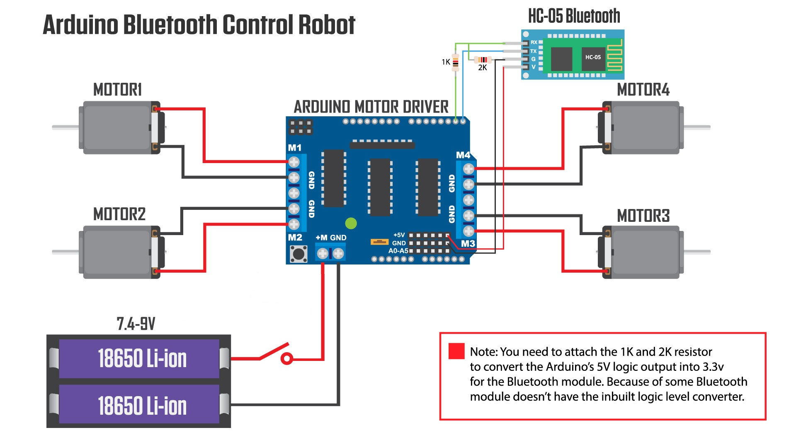
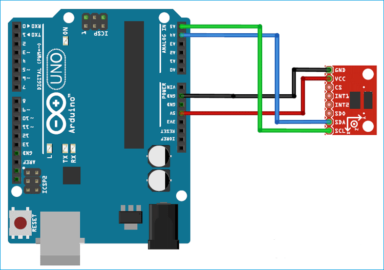
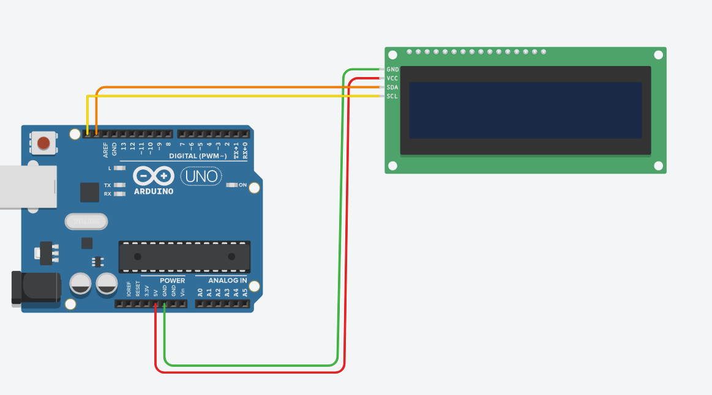
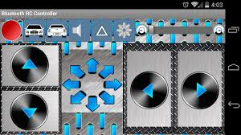
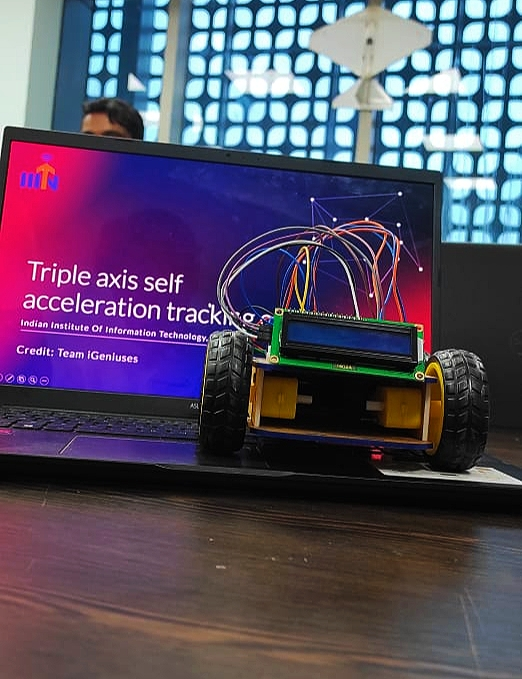
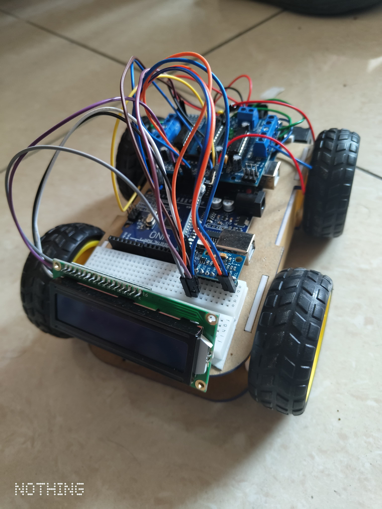

# 🚗 Triple Axis Acceleration Tracking Bluetooth RC Car

Hi, I am Satyam. This project is very special for me because it is the **first project I built in my college (First Semester Project)**.  
**Under the guidance of:**  
Dr. Rashmi Ranjan  
Assistant Professor, ECE Dept. (IIITN)  

Now I will be briefing the project objective, components used, how the project is made, and the circuit diagrams.

---

## 🧠 Project Objective

The objective of this project is to build a **Bluetooth-controlled RC car** that can be wirelessly navigated and simultaneously track the **acceleration in 3 axes (X, Y, Z)** using the **ADXL345 accelerometer sensor** and display it on an **I2C LCD**. This project combines embedded systems, sensors, and wireless communication into a smart vehicle prototype.

---

## ⚙️ Hardware Components

| Component               | Quantity |
|-------------------------|----------|
| Robo Chassis            | 1        |
| DC Motors               | 4        |
| Wheels                  | 4        |
| Li-ion Batteries        | 2        |
| Arduino Uno             | 2        |
| Breadboard              | 1        |
| Motor Driver Shield     | 1        |
| LCD Screen (I2C)        | 1        |
| ADXL345 Accelerometer   | 1        |
| HC-05 Bluetooth Module  | 1        |

---

## 🔌 Connection Diagrams

### 1. **Connection diagram of Arduino 1 with Motor Driver and Bluetooth sensor + 4 Motors**

- **Motor Driver Shield** → Controls 4 DC Motors  
- **HC-05 Bluetooth Module** → Connected to Arduino Uno for wireless command control

📸 Refer to the image below:  

---

### 2. **Connection diagram of Arduino 2 with ADXL345 and I2C LCD**

- **ADXL345 Accelerometer** → Connected to Arduino via I2C/SPI  
- **LCD Module (I2C)** → Displays real-time 3-axis acceleration data

📸 Refer to the images below:  
  

---

## 💾 Code

Upload the respective codes to each Arduino:

- `code1` → Arduino 1 (for Bluetooth RC control)
- `code2` → Arduino 2 (for 3-axis acceleration tracking)

### ✅ Libraries Required

- `Wire.h`  
- `LiquidCrystal_I2C.h`  
- `Adafruit_Sensor.h`  
- `Adafruit_ADXL345_U.h`  
- `AFMotor.h`

## 📱 Bluetooth RC Car Controller APK Setup

- Pair your phone with the **HC-05 Bluetooth module**
- Open the **Bluetooth RC Car** Android app
- Use the app’s control buttons to send movement commands

📱 **APK Interface Screenshot**:  

---

## 🏁 Result

Final working prototype of the project is shown below:

## 🏁 Result

Final working prototype of the project is shown below:

📸 **Project Images**:  

  
  

